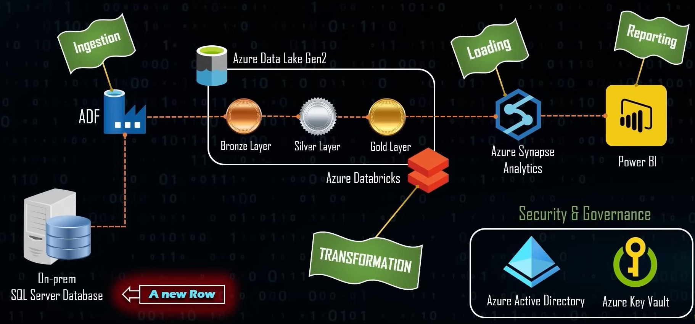
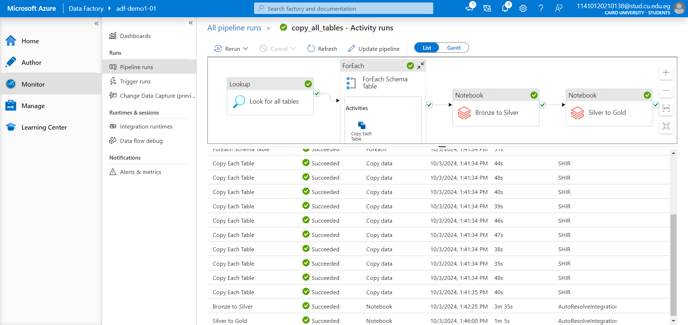
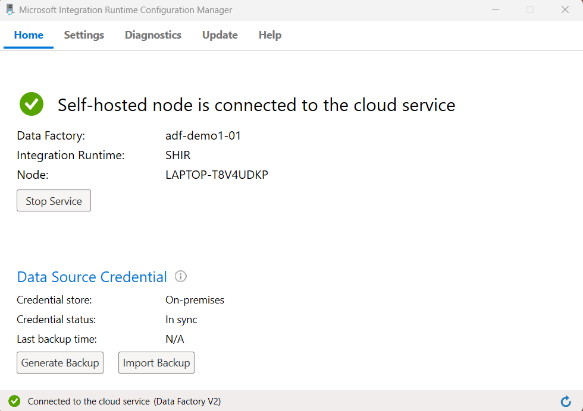
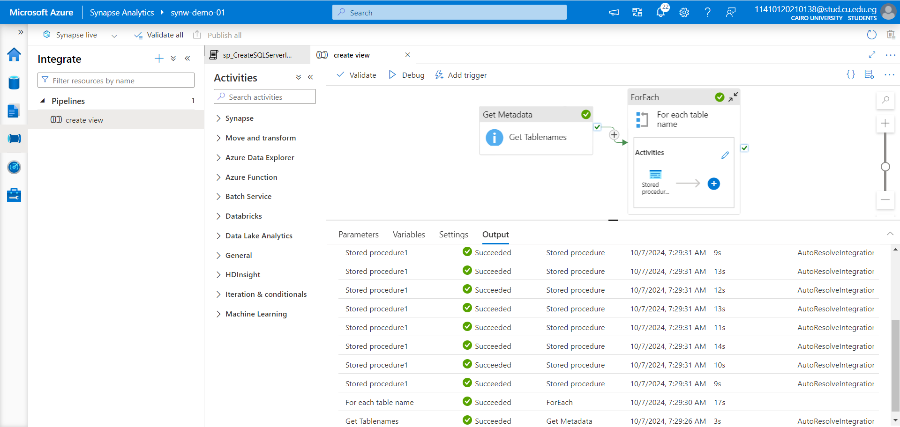

# AdventureWorks-Azure Data Pipeline

This repository contains an end-to-end data pipeline project for the AdventureWorks dataset, leveraging various Azure services to process, transform, and analyze data. The primary goal is to extract data from an on-premises SQL Server database, transform it through different stages, and load it into a data warehouse for analysis and reporting.

## Project Overview

### Architecture

The architecture of this project includes the following Azure services:

- **Azure Data Factory (ADF)**: Orchestrates data ingestion from SQL Server to Azure Data Lake Storage Gen2.
- **Azure Data Lake Storage Gen2**: Stores data across multiple stages (Bronze, Silver, Gold).
- **Azure Databricks**: Performs data transformation and processing between layers.
- **Azure Synapse Analytics**: Serves as the final data warehouse for analytical queries and reporting.
- **Azure Key Vault**: Secures sensitive information like database credentials.
- **Microsoft Power BI**: Visualizes the data for reporting and insights.

 <!-- Replace 'architecture.png' with the path to your architecture image -->

### Data Factory

**Azure Data Factory (ADF)** plays a key role in orchestrating the data pipeline, enabling data movement and transformation.

 <!-- Replace 'data_factory.png' with the path to your Data Factory image -->

### SHIR (Self-hosted Integration Runtime)

To facilitate data movement between the on-premises SQL Server and Azure, a **Self-hosted Integration Runtime (SHIR)** is used. It allows secure data transfer from on-premises environments to Azure Data Factory. Below is a screenshot of the SHIR configuration:

 <!-- Replace 'SHIR.png' with the path to your SHIR configuration image -->

### Azure Synapse Analytics

**Azure Synapse Analytics** serves as the central data warehouse, enabling complex analytical queries and reporting. It connects seamlessly with **Power BI** for data visualization.

 <!-- Replace 'synapse_analytics.png' with the path to your Synapse Analytics image -->

## Data Source

- **SQL Server**: AdventureWorks database (on-premises).
- **Objective**: Extract data from SQL Server for further processing and analysis.
- **Connection Security**: Utilized Azure Key Vault to securely store credentials, ensuring safe authentication when accessing the SQL Server database.

## Data Pipeline Workflow

### 1. Ingestion into Bronze Layer
- **Process**: Extracted raw data from the SQL Server database using Azure Data Factory and loaded it into the **Bronze Layer** in **Azure Data Lake Storage Gen2**.
- **Bronze Layer Purpose**: Acts as the initial staging area, preserving the raw data in its original format, serving as a reliable source for further transformations.

### 2. Transformation: Bronze to Silver
- **Notebook 1: Storage Mount**:
  - **Purpose**: Connects to Azure Data Lake Storage Gen2 and mounts the storage to Databricks, allowing seamless access to raw data.
- **Notebook 2: Bronze to Silver**:
  - **Purpose**: Transforms raw data from the **Bronze Layer** into a refined form in the **Silver Layer**. This includes:
    - Data cleaning and filtering.
    - Standardizing data formats for consistency.
    - Improving data quality for downstream processes.

### 3. Transformation: Silver to Gold
- **Notebook 3: Silver to Gold**:
  - **Purpose**: Converts cleaned and structured data from the **Silver Layer** into the **Gold Layer**. This stage includes:
    - Data aggregation and summarization.
    - Further data enrichment to support analytical queries.
    - Optimizing data for reporting and business insights.

### 4. Loading into Data Warehouse
- **Azure Synapse Analytics**: The transformed data from the **Gold Layer** is loaded into **Azure Synapse Analytics**, which serves as the data warehouse for running complex queries and analysis.

### 5. Reporting and Visualization
- **Power BI**: Connects to **Azure Synapse Analytics** for creating dashboards and visualizing insights derived from the processed data.

## Security and Governance

- **Azure Key Vault**: Secures sensitive information such as database connection strings, ensuring secure and compliant data access.
- **Azure Active Directory**: Manages user access and authentication for secure data processing.
